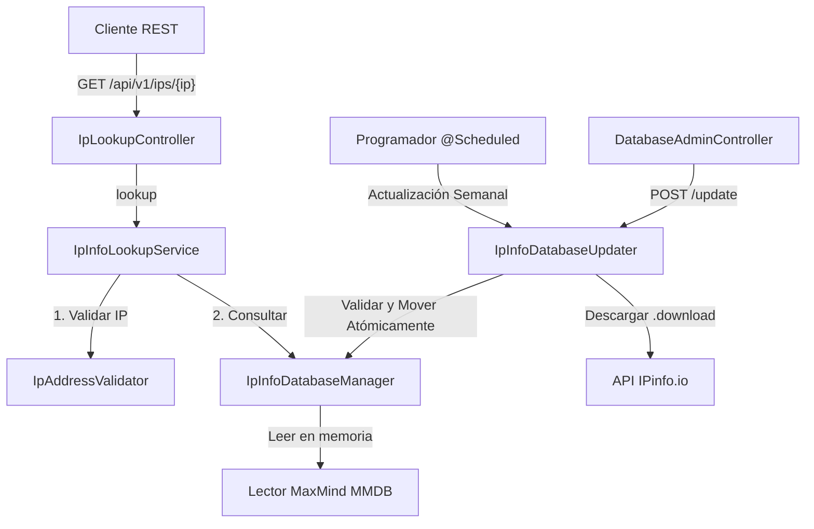

# Guía de Desarrollo - IPinfo Local Service

Esta guía está diseñada para desarrolladores que necesiten realizar mantenimiento, depurar o extender las capacidades del proyecto **IPinfo Local Service**.

---

## 1. Descripción General de la Arquitectura

**IPinfo Local Service** es un microservicio Spring Boot desarrollado con **Java 21** y **Spring Boot 3.5**. Su propósito es proporcionar consultas rápidas y locales de geolocalización de IPs utilizando archivos de base de datos en formato **MMDB** (*MaxMind Database*) provistos por **IPinfo Lite**.

El flujo general de la arquitectura se ilustra en el siguiente diagrama:



---

## 2. Requisitos Previos

Para trabajar en este proyecto, asegúrate de tener instalado y configurado:
*   **Java Development Kit (JDK) 21** o superior.
*   **Apache Maven 3.6.3** o superior.
*   Un editor o IDE compatible con Java (como IntelliJ IDEA, VS Code o Eclipse).
*   Una cuenta gratuita en [IPinfo.io](https://ipinfo.io) para obtener un **Access Token**.
*   **Docker** y **Docker Compose** (opcional, para empaquetado y pruebas de contenedores).

---

## 3. Estructura de Paquetes y Clases Principales

El código fuente del servicio se organiza bajo el paquete raíz `com.giovanni.ipinfo`:

*   **[IpInfoLocalApplication.java](src/main/java/com/giovanni/ipinfo/IpInfoLocalApplication.java)**: Clase principal que arranca la aplicación Spring Boot. Tiene habilitada la ejecución de tareas programadas (`@EnableScheduling`).
*   **`config`**:
    *   **[IpInfoProperties.java](src/main/java/com/giovanni/ipinfo/config/IpInfoProperties.java)**: Registro de configuración (`@ConfigurationProperties`) validado que mapea las variables de entorno relativas a IPinfo.
    *   **[DatabaseHealthIndicator.java](src/main/java/com/giovanni/ipinfo/config/DatabaseHealthIndicator.java)**: Integración con Spring Boot Actuator para exponer el estado de salud de la base de datos local en `/actuator/health`.
*   **`validation`**:
    *   **[IpAddressValidator.java](src/main/java/com/giovanni/ipinfo/validation/IpAddressValidator.java)**: Clase utilitaria que verifica sintácticamente las direcciones IPv4/IPv6 y descarta direcciones no públicas (loopbacks, locales, multicast, CGNAT `100.64.0.0/10`).
*   **`service`**:
    *   **[IpInfoLookupService.java](src/main/java/com/giovanni/ipinfo/service/IpInfoLookupService.java)**: Orquesta la validación de la IP y la consulta al administrador de la base de datos.
    *   **[IpInfoDatabaseManager.java](src/main/java/com/giovanni/ipinfo/service/IpInfoDatabaseManager.java)**: Gestiona el ciclo de vida del lector de base de datos MMDB en memoria. Implementa un esquema de concurrencia segura mediante `ReentrantReadWriteLock` para recargar la base de datos en caliente sin downtime de consultas.
    *   **[IpInfoDatabaseUpdater.java](src/main/java/com/giovanni/ipinfo/service/IpInfoDatabaseUpdater.java)**: Administra el flujo de descarga, validación del archivo temporal e invocación al reemplazo atómico de la base de datos.
*   **`controller`**:
    *   **[IpLookupController.java](src/main/java/com/giovanni/ipinfo/controller/IpLookupController.java)**: Expone las consultas de IP de cara al usuario.
    *   **[DatabaseAdminController.java](src/main/java/com/giovanni/ipinfo/controller/DatabaseAdminController.java)**: Expone endpoints administrativos para consultar el estado y forzar actualizaciones de la base de datos.
    *   **[GlobalExceptionHandler.java](src/main/java/com/giovanni/ipinfo/controller/GlobalExceptionHandler.java)**: Captura las excepciones de negocio y de validación para retornar códigos de estado HTTP semánticos (`400 Bad Request`, `404 Not Found`, `503 Service Unavailable`).
*   **`model` & `dto`**:
    *   **[IpInfoLiteRecord.java](src/main/java/com/giovanni/ipinfo/model/IpInfoLiteRecord.java)**: Mapeo directo de la estructura interna del archivo MMDB usando anotaciones `@MaxMindDbConstructor` y `@MaxMindDbParameter`.
    *   **`dto/*`**: Objetos de transferencia de datos de respuesta para las APIs.

---

## 4. Configuración del Entorno de Desarrollo

El microservicio utiliza variables de entorno (definidas también con valores por defecto en el archivo [application.yml](src/main/resources/application.yml)).

Para arrancar el proyecto de manera local, debes configurar al menos el token de IPinfo:

### PowerShell
```powershell
$env:IPINFO_TOKEN="TU_TOKEN_DE_IPINFO"
$env:IPINFO_DATABASE_PATH="C:\developer\ipinfo\ipinfo_lite.mmdb"
mvn spring-boot:run
```

### Bash / Linux / macOS
```bash
export IPINFO_TOKEN="TU_TOKEN_DE_IPINFO"
export IPINFO_DATABASE_PATH="./data/ipinfo_lite.mmdb"
mvn spring-boot:run
```

### Archivo `.env` (Docker)
Copia el archivo [.env.example](.env.example) a `.env` y define allí la variable `IPINFO_TOKEN`.

---

## 5. Diseño de Concurrencia y Recarga en Caliente

Un punto crítico para el desarrollo en este proyecto es comprender cómo se maneja la concurrencia al leer y escribir la base de datos en [IpInfoDatabaseManager.java](src/main/java/com/giovanni/ipinfo/service/IpInfoDatabaseManager.java):

1.  **Lecturas Concurrentes**: El endpoint `/api/v1/ips/{ip}` realiza consultas concurrentes adquiriendo un bloqueo de lectura compartido (`lock.readLock().lock()`). Esto permite que múltiples peticiones consulten el MMDB en memoria al mismo tiempo sin bloquearse entre sí.
2.  **Escritura (Recarga)**: Cuando se actualiza la base de datos de manera manual o programada, el método `reload(Path path)` adquiere un bloqueo de escritura exclusivo (`lock.writeLock().lock()`).
3.  **Transición Segura**: Durante el bloqueo de escritura, se crea el nuevo lector, se reemplaza la referencia atómica (`current.getAndSet(replacement)`) y se procede a cerrar el lector anterior. Esto asegura que ninguna consulta de IP falle o acceda a un recurso cerrado durante el proceso de actualización.

> [!IMPORTANT]
> Al modificar o extender el comportamiento del lector MMDB, mantén siempre el uso correcto de los bloques `try-finally` para asegurar la liberación de los locks en caso de cualquier excepción.

---

## 6. Agregar Nuevos Campos de Geolocalización

Si en el futuro se adquiere una base de datos más completa de IPinfo (por ejemplo, con campos de latitud, longitud, ciudad o código postal) y necesitas extender el servicio:

1.  Modifica el modelo **[IpInfoLiteRecord.java](src/main/java/com/giovanni/ipinfo/model/IpInfoLiteRecord.java)** agregando los nuevos campos.
2.  Asegúrate de agregar la anotación `@MaxMindDbParameter(name = "nombre_en_el_mmdb")` a los nuevos parámetros del constructor. El nombre debe coincidir exactamente con la clave interna que utiliza el formato MMDB de IPinfo.
3.  Extiende el DTO **[IpLookupResponse.java](src/main/java/com/giovanni/ipinfo/dto/IpLookupResponse.java)** y el mapeo en **[IpInfoLookupService.java](src/main/java/com/giovanni/ipinfo/service/IpInfoLookupService.java)**.

---

## 7. Pruebas y Validación

El proyecto incluye pruebas unitarias enfocadas en la validación sintáctica de IPs y rangos restringidos:

*   Ubicación: [IpAddressValidatorTest.java](src/test/java/com/giovanni/ipinfo/service/IpAddressValidatorTest.java).
*   Para ejecutar las pruebas:
    ```bash
    mvn test
    ```

---

## 8. Endpoints Útiles para Desarrollo

Puedes usar el archivo [requests.http](requests.http) si tu IDE soporta clientes REST integrados, o ejecutar comandos curl básicos:

*   **Consultar IP pública**:
    ```bash
    curl http://localhost:8080/api/v1/ips/8.8.8.8
    ```
*   **Obtener Estado de Base Local**:
    ```bash
    curl http://localhost:8080/api/v1/admin/database/status
    ```
*   **Forzar Descarga Inmediata**:
    ```bash
    curl -X POST http://localhost:8080/api/v1/admin/database/update
    ```
*   **Monitoreo Actuator**:
    ```bash
    curl http://localhost:8080/actuator/health
    ```
