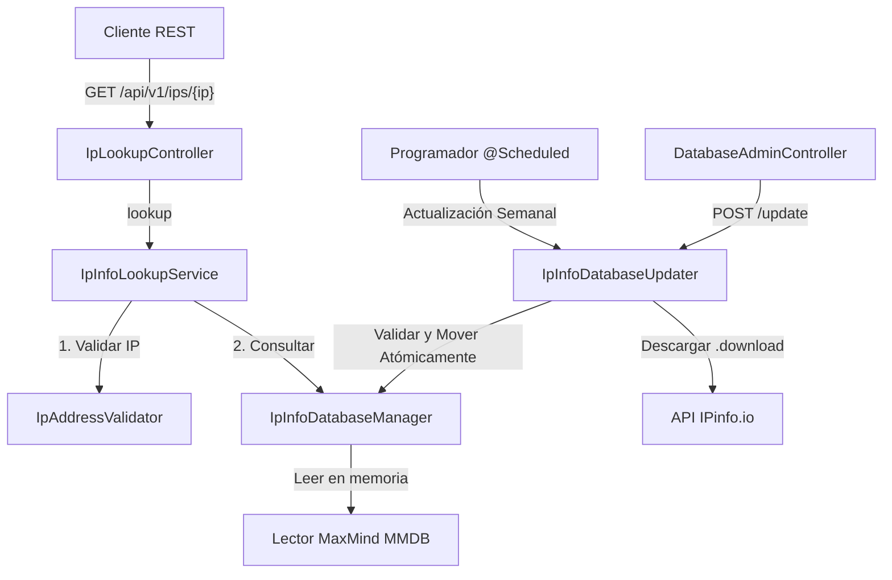

# Análisis del Proyecto: IPinfo Local Service

Este documento presenta un análisis técnico estructurado de la base de código del proyecto **IPinfo Local Service**. El servicio es un microservicio autocontenido en Spring Boot desarrollado con Java 21 que gestiona y consulta localmente una base de datos MMDB (*MaxMind Database*) de **IPinfo Lite** para geolocalización de IPs.

---

## 1. Arquitectura y Flujo de Información

El microservicio está diseñado para ser de alto rendimiento, evitando realizar consultas de red externas para cada dirección IP recibida. Toda la resolución se ejecuta localmente contra el archivo de base de datos cargado en memoria.

El flujo general se resume en el siguiente diagrama:

---

## 2. Componentes Principales del Sistema

A nivel de código, el proyecto se divide en las siguientes capas y clases:

| Componente | Clase / Ruta | Propósito |
| :--- | :--- | :--- |
| **Punto de Entrada** | [IpInfoLocalApplication](src/main/java/com/ipinfo/IpInfoLocalApplication.java) | Inicializa la aplicación con soporte para programación de tareas (`@EnableScheduling`) y propiedades externas (`@EnableConfigurationProperties`). |
| **Controlador Público** | [IpLookupController](src/main/java/com/ipinfo/controller/IpLookupController.java) | Expone el endpoint de consulta GET `/api/v1/ips/{ip}`. |
| **Controlador de Administración** | [DatabaseAdminController](src/main/java/com/ipinfo/controller/DatabaseAdminController.java) | Expone endpoints para comprobar el estado `/status` y forzar manualmente la actualización `/update` de la base de datos MMDB. |
| **Servicio de Negocio** | [IpInfoLookupService](src/main/java/com/ipinfo/service/IpInfoLookupService.java) | Orquesta las llamadas de validación y la recuperación del registro de datos. |
| **Manejador de Base de Datos** | [IpInfoDatabaseManager](src/main/java/com/ipinfo/service/IpInfoDatabaseManager.java) | Controla el lector en memoria (`com.maxmind.db.Reader`) usando un bloqueo de lectura/escritura (`ReentrantReadWriteLock`) para permitir recargas en caliente. |
| **Actualizador de Base de Datos** | [IpInfoDatabaseUpdater](src/main/java/com/ipinfo/service/IpInfoDatabaseUpdater.java) | Gestiona la descarga semanal automática, la verificación del archivo descargado y su posterior reemplazo a nivel de sistema de archivos. |
| **Validador de IP** | [IpAddressValidator](src/main/java/com/ipinfo/validation/IpAddressValidator.java) | Analiza sintácticamente la IP. Valida que no sea un dominio y descarta IPs no enrutables públicamente (locales, loopback, multicast, privadas y el bloque CGNAT `100.64.0.0/10`). |
| **Mapeo de Datos** | [IpInfoLiteRecord](src/main/java/com/ipinfo/model/IpInfoLiteRecord.java) | Estructura interna mapeada mediante anotaciones específicas del SDK de MaxMind (`@MaxMindDbConstructor` y `@MaxMindDbParameter`). |
| **Salud del Sistema** | [DatabaseHealthIndicator](src/main/java/com/ipinfo/config/DatabaseHealthIndicator.java) | Expone la salud y detalles de la base de datos a través de Spring Boot Actuator en `/actuator/health`. |

---

## 3. Concurrencia y Recarga en Caliente

Un aspecto de diseño destacado del proyecto es la forma en que garantiza que la base de datos se pueda actualizar sin interrumpir las consultas entrantes (cero *downtime*):

1. **Lectura Compartida**: 
   Múltiples peticiones HTTP concurrentes pueden invocar simultáneamente `lookup(...)`. Esto se logra adquiriendo un bloqueo compartido de lectura `lock.readLock().lock()` sobre un `ReentrantReadWriteLock`.
2. **Escritura Exclusiva**: 
   Durante una actualización exitosa, el actualizador descarga y valida el archivo en una ruta temporal (`.download`). Solo al final del proceso, el actualizador solicita recargar la base de datos. `IpInfoDatabaseManager` adquiere entonces el bloqueo exclusivo de escritura `lock.writeLock().lock()`.
3. **Reemplazo Atómico de Referencia**: 
   Mientras se mantiene el bloqueo de escritura, se instancia un nuevo lector MMDB, se almacena en el contenedor atómico `AtomicReference<LoadedDatabase>` y se cierra el lector anterior. Finalmente, se libera el bloqueo.

> [!NOTE]
> Este esquema asegura consistencia y evita errores de punteros nulos o fallos por lectura de un lector cerrado mientras se realiza el mantenimiento del archivo físico.

---

## 4. Estrategia de Descarga Segura y Resiliencia

El actualizador `IpInfoDatabaseUpdater` implementa mecanismos de control de errores rigurosos:

* **Descarga a Temporal**: Nunca descarga el contenido directamente sobre el archivo activo. En su lugar, usa un sufijo `.download`.
* **Validación de Código y Tamaño**: Comprueba que la respuesta HTTP sea exitosa (`200 OK`) y que el archivo tenga un tamaño mínimo preconfigurado (por defecto `1,000,000` bytes) para evitar reemplazar una base de datos válida por un archivo dañado o vacío.
* **Validación de Estructura**: Antes de realizar el cambio de archivo, abre temporalmente el archivo MMDB descargado y verifica que contenga metadatos válidos de MaxMind.
* **Reemplazo Atómico**: Utiliza `StandardCopyOption.ATOMIC_MOVE` si el sistema de archivos del sistema operativo lo soporta (con *fallback* a un movimiento clásico).
* **Conservación de Base de Datos Anterior**: Si alguna de las validaciones de descarga o estructura falla, el flujo se interrumpe y la base de datos anterior sigue activa sin alteración alguna.
* **Exclusión Mutua**: Un bloqueo `ReentrantLock updateLock` evita ejecuciones concurrentes de la actualización (por ejemplo, si una actualización programada coincide con una manual).

---

## 5. Configuración e Integración Continua

El proyecto expone un conjunto de variables de entorno configurables en `application.yml`:

* `IPINFO_TOKEN`: Token de autenticación del portal de desarrolladores de IPinfo.
* `IPINFO_DATABASE_PATH`: Ruta local donde se almacena el archivo `.mmdb` (por defecto `./data/ipinfo_lite.mmdb`).
* `IPINFO_UPDATE_CRON`: Expresión cron para la actualización automática. Por defecto configurada para el sábado a las 03:00 AM hora de Colombia (`0 0 3 * * SAT`).
* `IPINFO_UPDATE_ZONE`: Zona horaria para evaluar el cron (`America/Bogota`).
* `IPINFO_MINIMUM_FILE_SIZE_BYTES`: Tamaño mínimo aceptado para evitar archivos corruptos.

### Docker y Kubernetes
* **Docker**: Se proporciona un archivo `Dockerfile` basado en `eclipse-temurin:21-jre-alpine` que se ejecuta bajo un usuario no-root (`app`) para mejorar la seguridad del contenedor. Adicionalmente, incluye `docker-compose.yml` que utiliza un volumen con persistencia (`ipinfo-data`) para conservar la base de datos MMDB descargada entre reinicios.
* **Kubernetes**: Los recursos en `k8s/` definen un Deployment con `replicas: 1` para asegurar un solo programador de actualizaciones activo, integrando Probes de Liveness/Readiness apuntando al Actuator, límites de recursos de CPU/Memoria y un `PersistentVolumeClaim` para el volumen de datos.

---

## 6. Recomendaciones de Seguridad y Escalabilidad

Al analizar el diseño, se identifican las siguientes áreas de oportunidad si se requiere llevar el microservicio a un entorno de producción a gran escala:

1. **Seguridad en Endpoints Administrativos**:
   Los endpoints `/api/v1/admin/**` están expuestos sin autenticación. En producción, se deben proteger mediante Spring Security (por ejemplo, requiriendo Basic Auth o un Token específico), limitándolos a la red interna, o filtrándolos en la capa del API Gateway/Ingress.
2. **Descargas Duplicadas en Clústeres Escalados**:
   Si el Deployment de Kubernetes se escala a múltiples réplicas (por ejemplo, 3 pod réplicas) compartiendo el mismo volumen de datos, se podrían originar conflictos de lectura/escritura si varias réplicas intentan descargar o actualizar el archivo al mismo tiempo. 
   * *Solución recomendada*: Configurar que solo un Pod específico realice las actualizaciones o delegar la tarea de descarga semanal a un Kubernetes `CronJob` independiente que monte el PVC de datos, dejando el microservicio exclusivamente en modo de consulta de solo lectura.
3. **Mapeo de Campos Extendidos**:
   La clase `IpInfoLiteRecord` está fuertemente tipada para los campos disponibles en la base de datos gratuita de **IPinfo Lite** (Country, Continent, ASN, Organization). Si se cambia a una base de datos de pago (por ejemplo, con campos de geocoordenadas, código postal o ciudad), se deberán extender el Record y los DTOs correspondientes para evitar ignorar información relevante.
